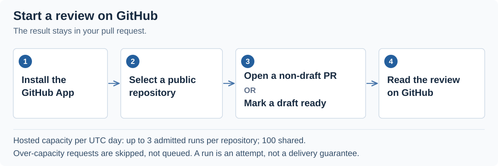

# LlamaPReview

**Open-source pull request review for public GitHub repositories.**

LlamaPReview reviews a pull request at its exact head commit, explains findings against the code, and reports known gaps in the evidence.

Free hosted GitHub App · Public repositories only · Apache-2.0 source

[**Install for a public repository**](https://github.com/marketplace/llamapreview) · [**See a real review**](https://github.com/Texarkanine/SumMem/pull/10#pullrequestreview-4978442337) · [**Read the source**](https://github.com/JetXu-LLM/LlamaPReview/tree/main/lambdas)

[](https://github.com/JetXu-LLM/LlamaPReview/actions/workflows/ci.yml)
[](LICENSE)
[](https://www.python.org/)
[](https://github.com/JetXu-LLM/LlamaPReview/releases)

## See the result

From a [published review on Texarkanine/SumMem#10](https://github.com/Texarkanine/SumMem/pull/10#pullrequestreview-4978442337):

> ### LlamaPReview — Blocking issues found
>
> Do not merge until the nap instruction names the runnable driver path, matching the activation scheme this PR ships; currently the printed instruction tells agents to run `summem`, not `.summem/summem`.
>
> Exact-head CI remains unresolved (1 pending); no CI-dependent merge-safety claim is made.

In this public review, LlamaPReview flagged a mismatch between the command an agent was told to run and the executable path shipped by the PR. It also recorded unresolved CI separately. This is one historical example, not a measure of overall accuracy. [Another public example](https://github.com/mmayasaurus/heddle/pull/66#pullrequestreview-4977897488) is available to inspect.

A substantive review includes findings, evidence and suggested next steps. It can also include zero or more inline comments where findings can be placed safely, and an optional diagram when it helps explain the change. Known evidence gaps remain visible. See the [output contract](docs/REVIEW_OUTPUT.md) for the exact behavior.

## Install and run



1. [Install the GitHub App](https://github.com/marketplace/llamapreview) and select the public repositories you want reviewed.
2. Open a non-draft pull request, or mark a draft ready for review.
3. Read the review on GitHub and check its findings against the code.

The app does not review every push. Reviews use GitHub's `COMMENT` state, not `APPROVE` or `REQUEST_CHANGES`, and are not a required merge check.

## Hosted capacity and limits

The free hosted service admits up to **3 review runs per repository per UTC day**, within a **shared 100-run daily limit**. Capacity counts attempts admitted after deterministic skip checks and before the first paid model call; it does not guarantee three successfully delivered reviews. A retry of the same run reuses its admission within the same UTC day; a retry after UTC rollover needs that day's capacity.

Over-capacity requests are skipped, not queued for the next day. The first ordinary request over a repository's limit may receive a skip notice; later requests that day stop quietly. The global limit is always silent. See the [capacity policy](docs/CONFIGURATION.md#free-review-capacity) and [failure and skip messages](docs/REVIEW_OUTPUT.md#failure-and-skip-messages).

Reviews can miss issues or be wrong; they supplement your tests and review process. Repository evidence is bounded, and missing coverage remains a gap. New private-repository events are discarded before product storage or model processing. Read the [privacy and retention policy](docs/PRIVACY.md) and [security model](docs/SECURITY.md).

## How it works

This repository contains the Webhook and Pipeline source used by the hosted service, under Apache-2.0. Inspect the evidence retrieval, output validation and publication path.


The model supplies engineering judgment; code enforces evidence boundaries, output validation, safe placement and publication. The reviewed head is checked again through the pipeline and before publishing. Recovery reuses the saved request instead of regenerating its body or changing its invitation footer.

For implementation details, start with the [architecture](docs/ARCHITECTURE.md) and [documentation index](docs/README.md). Evidence retrieval uses [llama-github](https://github.com/JetXu-LLM/llama-github), an independently released SDK.

## Self-host

Run the public-repository review pipeline in your own AWS account. Supply your own GitHub App and model-provider credentials, and pay your own AWS and provider costs.

1. Download a semantic release and [verify its checksums and GitHub provenance](docs/RELEASE_VERIFICATION.md).
2. Follow the [AWS deployment guide](docs/AWS_DEPLOYMENT.md) and [self-hosting boundary](docs/HOSTING.md).
3. Choose a provider using the [configuration guide](docs/CONFIGURATION.md#review-routing). New source installations default to an OpenRouter GPT-6 Luna max trial with [documented qualification limits](docs/QUALITY_UPGRADE.md#validation-boundaries). `MODEL_PROVIDER=deepseek` selects the existing DeepSeek profile; retaining both provider keys enables a one-setting return to DeepSeek.

The source default is separate from the hosted deployment's provider setting. The hosted service uses DeepSeek, as disclosed in its [Privacy Policy](https://jetxu-llm.github.io/LlamaPReview-site/privacy.html).

The reference Terraform stack disables hosted quota counters by default (`pipeline_capacity_policy=off`) and leaves one-time head succession enabled. It still supports public repositories only. Public CI publishes release artifacts; it does not deploy the official AWS service.

## Develop and contribute

Ordinary tests and replay fixtures make no paid provider calls.

```bash
python3.12 -m venv .venv
source .venv/bin/activate
python -m pip install -r requirements-ci.txt
make verify
```

Read [development and testing](docs/DEVELOPMENT.md) for local and release gates, and [CONTRIBUTING.md](CONTRIBUTING.md) before opening a pull request. Use [Issues](https://github.com/JetXu-LLM/LlamaPReview/issues) for reproducible bugs and [Discussions](https://github.com/JetXu-LLM/LlamaPReview/discussions) for questions and public review examples. Report vulnerabilities through [SECURITY.md](SECURITY.md).

| Path | Responsibility |
| --- | --- |
| `lambdas/LlamaPReviewWebhookHandler` | Signed event and public-repository admission |
| `lambdas/LlamaPReviewPipeline` | Retrieval, judgment, validation, recovery and publication |
| `infra/terraform` | Generic AWS reference deployment |
| `scripts`, `tests` | Reproducible builds and safety checks |
| `docs` | Operator and contributor documentation |

## License

[Apache License 2.0](LICENSE). Dependency notices are recorded in [THIRD_PARTY_NOTICES.md](THIRD_PARTY_NOTICES.md) and each release inventory. Visit the [official website](https://jetxu-llm.github.io/LlamaPReview-site/) for the hosted service.
