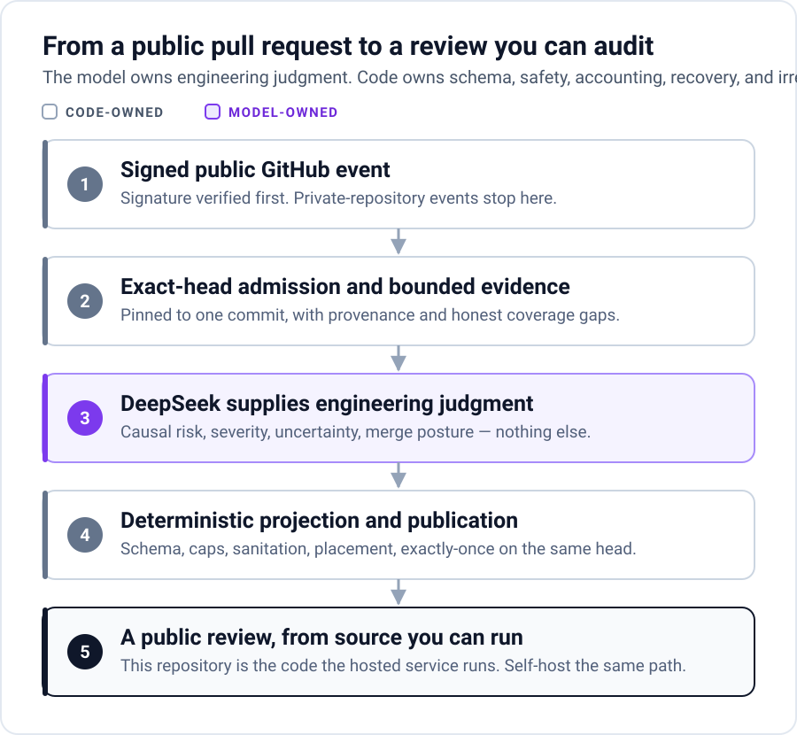

# Architecture

LlamaPReview has one production path:

```text
verified GitHub webhook
→ public/private eligibility
→ exact-head admission
→ Route
→ bounded exact-head retrieval / PFR
→ Deep engineering judgment
→ Final presentation
→ deterministic Projection and local degradation
→ lifecycle-bound, exact-head, idempotent GitHub publication
```



## Capability ownership

| Capability | Owns | Does not own |
| --- | --- | --- |
| Webhook admission | Signature verification, event eligibility, the hosted public-only boundary, minimum exact-head queue input | Retrieval, model work, publication |
| Retrieval / PFR | Bounded repository evidence, provenance, coverage, and explicit gaps | Findings or merge posture |
| Deep | Causal engineering judgment, severity, uncertainty, and merge posture | Markdown layout or GitHub placement |
| Final | Compression, organization, owner-action language, inline requests, diagram presentation | Evidence retrieval or deterministic sanitation |
| Projection / rendering | Public schema, stable identities, caps, syntax, sanitation, local optional-surface degradation, GitHub payload shape | Engineering judgment |
| Provider transport / accounting | Dispatch fences, retries, usage, logical and billed model identity, tokens, trace, and cost truth | Review policy |
| Persistence / publication | Durable phase ownership, exact-head recovery, intent and receipt, exactly-once external effects | Workflow sequencing or model decisions |
| Orchestrator | Deadlines, sequencing, and terminal flow | A second copy of any capability above |

Deep begins its handoff with three model-owned commitments: pull-request
objective, objective closure (`supported`, `contradicted`, or `unresolved`),
and merge posture. Final preserves that opening instead of inferring a new
verdict from later ordinary unknowns. These are prompt-level judgments, not a
new public schema field or a code parser for natural language.

## Trust boundaries and invariants

### Private hosted events

The Webhook verifies the signature, reads event type and repository visibility, and acknowledges a private-repository event before it constructs a pipeline item. The application performs no DynamoDB or S3 write, provider call, GitHub product API call, or identity-bearing application log for that event.

### Exact-head evidence

The queued head SHA is not treated as sufficient proof. The Pipeline rereads the pull request lifecycle and head before context work, before the first expensive PFR Reconcile, before Final presentation, and before publication. Repository reads are pinned to that head where GitHub supports an exact ref. Evidence records carry provenance and coverage rather than silently promoting search hints to facts.

### Bounded free capacity

The hosted service allocates a finite personally funded budget, so admission
charges a per-repository daily bound and a global circuit breaker before Route,
which is the first paid call. Deterministic skips are charged nothing, so a
repository whose traffic is mostly skipped keeps its capacity for the reviews
that would actually run. One UTC-day sentinel in the existing table owns both
counters and the admitted run identities. A single conditional update checks
both limits, increments both counters, and records the exact repository, pull
request, run, head, and successor-derived admission identity. Retrying that run
within the same UTC day reuses its daily admission; a retry after rollover is
charged against the new day's quota. Code-owned repository and global maxima of
512 reject unsafe numeric configurations, while the global bound keeps the
single item's admission IDs, repository counters, and notice owners below the
DynamoDB item limit. A global rejection cannot partially consume repository
capacity. The day's one repository notice is bound to the exact blocked
admission that owns it. The self-hosted Terraform reference disables these
hosted bounds by default.

### Lifecycle disposition and bounded succession

Admission owns one typed description of the current pull request state relative
to the reviewed head:

- open, merged, or closed on the same head;
- open, merged, or closed on a newer head;
- unverified when the current state cannot be proved.

The orchestrator consumes that disposition; retrieval, review generation, and
publication do not independently infer lifecycle policy. The first successful
open/same-head admission is durable, so a retry cannot mistake a pull request
that ended before work began for one that ended during an admitted review.

An early open-head change, detected at context admission or immediately before
the first Reconcile, may create exactly one successor for the new head. The
predecessor remains a fully accounted superseded run. The successor is created
by an owner-bound conditional update with a deterministic identity; it cannot
chase another head change. A late head change remains a silent fail-closed
supersession and can never publish the old review.

| Observed transition | Before first Reconcile | After first Reconcile |
| --- | --- | --- |
| Open, same head | Continue | Continue |
| Open, newer head | Requeue one successor at most | Supersede silently |
| Merged/closed, same head after admission | Stop remaining model work and prepare a code-owned cancellation when the native review surface is available | Cancel, unless a publishable Final already exists for the exact merged head; a locked review surface supersedes silently |
| Merged/closed, newer head | Supersede silently | Supersede silently |
| Unverified | Retry or fail closed without publication | Retry or fail closed without publication |

A publishable Final that finishes after the exact reviewed head was merged may
be projected as a post-merge follow-up. A closed-unmerged pull request receives
only the cancellation. Pull requests already ended at initial admission receive
no public message. GitHub can lock a pull request before or during merge and
then reject native reviews. A structurally verified locked surface is recorded
as `publication_unavailable_locked` and superseded silently; it is not retried,
treated as a provider failure, or redirected to an issue comment.

### Model and code boundaries

The model owns engineering judgment. Code owns bounded inputs, sensitive-path exclusions, schema validation, sanitation, output limits, placement, payload construction, durable state, and publication identity.

Projection separates evidence truth from presentation placement. Required
evidence references support an item's causal claim; a snippet only requests an
anchor on the changed diff. Invalid supporting references may be removed, and
unknown required references may be removed only when another admitted required
reference for the same item survives. An invalid snippet or inline target can
therefore degrade to a body-only finding without weakening the evidence gate.
A malformed nondeciding item or optional Mermaid surface may be removed with
its dependent prose. Projection fails closed when the final deciding basis is
lost, truth-dependent core prose remains tainted, the provider envelope is
incomplete, or fixed schema and size bounds cannot be met without guessing or
inventing evidence.

The first screen is projected from the primary retained merge-deciding item and
its immediate owner action. A blocking finding or merge-deciding unknown leads;
every other finding or unknown stays below the fold and contributes only to a
count of further items. If a deciding item is removed locally, its dependent
summary/action copy is removed too and the surface contracts to the next
admitted deciding item.

Deep evaluates author-stated acceptance outcomes separately. A claim that the
PR repairs a preexisting failure across several devices, actors, branches, or
surfaces is closed only when exact evidence shows the PR-created delta reaches
each decisive surface, or proves an unchanged surface already met the claimed
outcome. Merely finding a coherent unchanged path cannot prove that the PR
fixed it. Objective closure supplements rather than replaces raw-delta defect
discovery: independently evidenced high-consequence failures remain separate
findings even when an objective-closure contradiction already blocks merge.
Only findings with the same causal root are clustered.

Within PFR's existing bounds, the planner spends capacity in this order:
concrete author acceptance criteria from the pull request or explicitly linked
acceptance material; the authoritative runner, discovery configuration,
workflow, or entrypoint when the change touches tests, CI, or validation
infrastructure; the highest-consequence locally answerable Route fact; then
general exploration. The executor preserves that semantic order across read,
search, and directory tools. The sole deterministic exception is the existing
reserved removed-symbol check, which remains first so a soft time budget cannot
erase it.

If the first bounded read of a priority fact exposes only part of the deciding
implementation, Reconcile may broaden the symbol slice on that same cached
exact-head file. The existing one-read soft-budget rescue treats that broader
slice as new evidence scope, without another repository fetch or a larger
question, round, or token budget. If Reconcile serializes eligible follow-ups
in a different order, that sole rescue remains bound to the earliest matching
Plan read rather than the first serialized follow-up. The evidence ledger
records each question, observation, and resolution; qualification can audit
whether an established fact reached Deep without moving that audit into
runtime judgment.

The planner requests one canonical object shape for each acceptance criterion,
but deterministic normalization also accepts the equivalent nonempty string
form so provider formatting drift cannot erase author-stated conditions. For a
small exact-head file already fetched completely within the full-file evidence
cap, a missed optional symbol anchor falls back to that exact full file. Large
or truncated files still require a real bounded symbol hit; no fuzzy anchor or
partial payload is promoted to full-file evidence.

Literal symbol reads use runtime-owned declaration recognition in addition to
the SDK's diff-context hints. The bounded slice therefore starts at the exact
exported function, constant, class, or other supported declaration that was
requested, rather than inheriting the nearest earlier definition merely because
the dependency's context patterns do not recognize that declaration form.

Diff-derived removed-symbol coverage includes language visibility modifiers,
including Rust `pub` and scoped `pub(...)` declarations. Its first removed
symbol retains the existing code-owned search floor ahead of model-selected
exploration; this is retrieval evidence, not a deterministic compile verdict.

### Exactly-once publication

Before a GitHub write, the Pipeline stores an immutable publication candidate and an owner-bound intent. The candidate binds an explicit publication kind—ordinary review, lifecycle cancellation, or post-merge follow-up—to the exact head and required lifecycle disposition. After the intent becomes `dispatching` but immediately before `create_review`, the Pipeline fetches a fresh pull-request snapshot and revalidates head, state, merged disposition, and the failed-notice lock requirement. A confirmed mismatch raises `publication_pre_dispatch_abort` and stores `publication_post_started=false`; this typed path proves zero GitHub writes even though the intent had reached `dispatching`. Any `dispatching` intent without that typed terminal proof or an exact receipt remains `publication_outcome_unknown` and must be reconciled because the POST may already exist. After dispatch the Pipeline reconciles the payload digest, bot identity, exact commit, and returned GitHub identifiers. Retries reuse the durable candidate or receipt; they do not regenerate and blindly post a second review or fall back to an issue comment.

The code-owned `Review unavailable` body is also an `ordinary_review`
candidate. It enters this same transaction only after paid work completed and
bounded Final/Projection retries were exhausted, while the PR is proven open,
unlocked, and on the same head. Lifecycle is revalidated before candidate
persistence and dispatch. New-head, ended, locked, quota/successor, pre-Final,
and provider-outcome-unknown states remain private or retain their existing
typed terminal outcome. Its private artifact preserves the generation failure
and accounting evidence, marks quality unscoreable, and consumes no additional
capacity. No alternate publication kind, second Final call, or fallback write
path exists.

### Accounting truth

Each provider HTTP attempt has a durable dispatch fence and a stable operation identity. The ledger retains logical routing identity, billed transport identity, status, token classes, and usage. A successful review cannot make a discarded or retried provider call disappear from accounting.

The provider boundary exposes two different typed failures. If the durable
fence cannot be proven before HTTP, `provider_dispatch_fence_unavailable` is a
retryable zero-dispatch abort: the HTTP request was not made. If a durable
`dispatching` record exists without a terminal transport result,
`provider_dispatch_outcome_unknown` is terminal for that run: a second call is
withheld and numeric usage remains explicitly incomplete. Error-message text
never upgrades the latter into proof that no dispatch occurred.

Lifecycle cancellation and supersession do not erase work that already
occurred. Content-safe telemetry records each checkpoint disposition, successor
count, publication kind, remaining deadline before each Reconcile, elapsed
provider time, and the same complete token/accounting facts used by ordinary
reviews. The second bounded Reconcile remains available; lifecycle checks do
not introduce a fixed wait or an implicit deadline-based skip.

## Repository map

```text
lambdas/LlamaPReviewWebhookHandler/   signed public-only admission adapter
lambdas/LlamaPReviewPipeline/         active review runtime
  context_engine/                     bounded exact-head retrieval and PFR
  review/                             judgment, presentation, projection, rendering, publication
infra/terraform/                      generic AWS reference deployment
scripts/                              deterministic build and verification tools
tests/                                unit, replay, adversarial, privacy, and recovery contracts
docs/                                 current public operating and contributor documentation
```

Large modules are kept when they have one stable owner and a cohesive invariant set. File size alone is not an architectural reason to introduce forwarding facades, generic provider protocols, or a second lifecycle.
